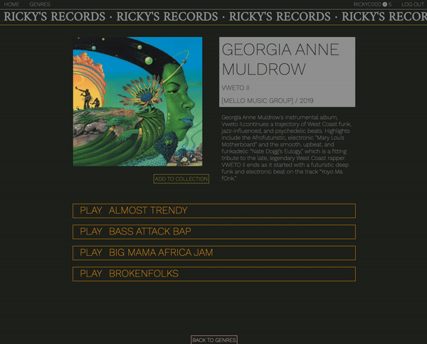
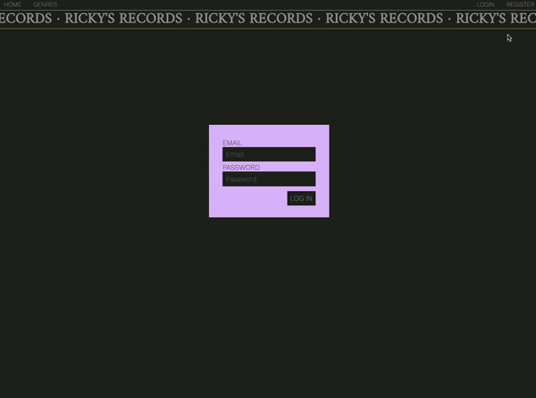
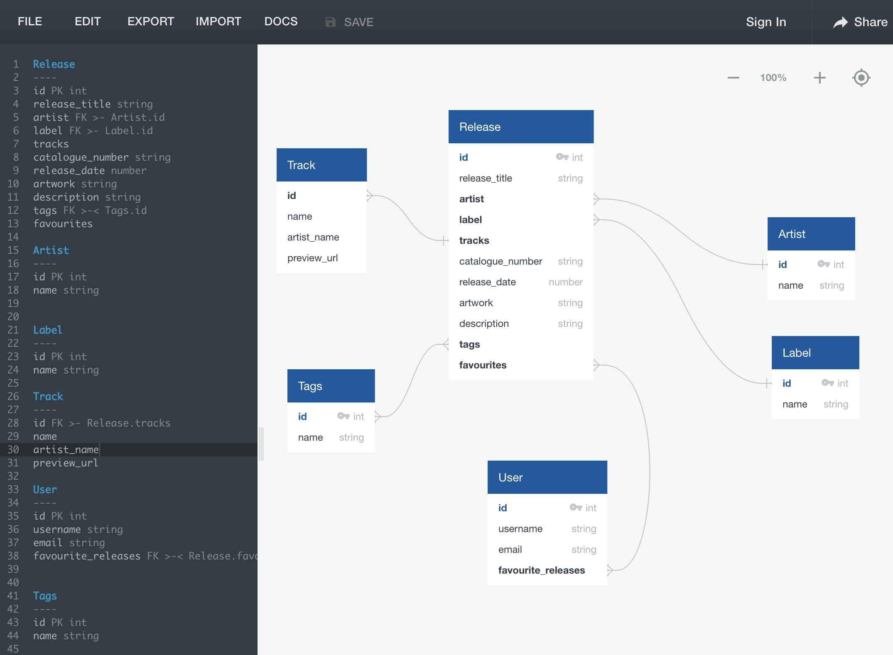

<!--  -->


# General Assembly Project 4: Ricky's Records

## Project Brief
My fourth and final project as part of GA's Software Engineering Immersive course was to build a full-stack application using Django REST framework to serve our data from a Postgres database. Our API had to be consumed by a separate front end built with React.

## Timeframe
7 days

## Technologies Used

* Python
* Django
* Django REST Framework
* HTML5
* React.js
* React Router DOM
* JavaScript
* Sass
* Git / GitHub
* Insomnia
* Axios
* Google Fonts
* React-slick
* React Audio player
* Quick DBD
## Deployed Version
https://rickys-records.herokuapp.com/


## Code Installation


## App Overview

Having previously worked in music retail, I wanted to create my own music platform featuring a range of music that I'm currently into.

Ricky's Records is a platform for discovering both old and new music through browsing, reading blurbs and listening to audio previews. 

My goal here was to present some incredible releases in an interesting way, allowing users to explore music they may not have previously come across. I also wanted to provide the option to save music to an account to revisit at a later date.

### Homepage

The homepage shows a number of different features: Featured Albums, Label Focus, New Releases and Artist Focus as well as a link to the genres page.

This is achieved by 'tagging' the content - adding Tag fields to a release such as 'Label Focus. Ordering the content in this way would allow me to easily change the shopfront-style homepage, in the same way online stores update their homepage features on an often weekly cycle.


### Show Page & Player

Having clicked through to a release show page, the track, artist and label information alongside the artwork and a blurb are presented. 

Below this, some or all tracks from a release are available as previews for almost all releases on the site. Clicking PLAY will raise the player bar at the footer of the page, presenting a durtion bar, track information, artwork and a volume control. Should the user then navigate away from this page, the audio preview will continue to play and still be loaded in the player at the bottom of the page.

If the user is logged in, the option 'Add To Collection' is visible below the artwork, allowing the user to Favourite the release.



### Genres Page

In what is essentially a release index, user's can view all releases of filter by different genre groups. The product cards featured here have been reused from the homepage keeping a consistent feel across the app.


### Profile Page

All releases that have been added to a collection whilst logged in can be found in the user's profile page. Under the banner 'Your Collection', the releases and their corresponding tracks are displayed and users can listen to audio previews, again activating the audio player at the footer of the page.


### Forms

Login and register forms allow users to create an account and login to their user account, accessing their saved collection. Error messaging notifies the user if there's an issue with their login credentials, or if their username/password is invalid/has already been taken.


## Process

### Planning

This project is loosely based on sites like [Bleep](bleep.com) and [Boomkat](https://boomkat.com/) so I had a fairly clear idea in my head of what I wanted to achieve. My planning process therefore focussed on working out which specific features I definitely wanted to include and would be achievable in the timeframe.

I settled on an MVP plan that would enable me to incorporate a number of the topics covered in module 4 of GA's course relating to Django REST Framework, whilst allowing myself sufficient time to focus on implementing a clean front-end design. 

Using QuickDBD I was able to create a visual representation of my data. This proved to be a valuable tool in terms of identifying which tasks needed to be completed to build the back-end for this project.


## Development

### Back End

The Release model defines the data required to make up any album, EP or single added to the database. 

Foreign Keys are used to define the one-to-many relationships between releases and artists and labels, whilst tags and favourites are included as many-to-many relationships.

The on_delete kwarg tells the database what to do if the referenced object is deleted.

The `__str__` method allows us to see the Release title in the site administration page, making this data easier to read.

```
class Release(models.Model):
    title = models.CharField(max_length=100, unique=False)
    release_year = models.PositiveIntegerField(unique=False)
    artwork = models.CharField(max_length=300)
    description = models.TextField(max_length=2000, blank=True)
    buy_link = models.CharField(max_length=300)
    artist = models.ForeignKey(
        "artists.Artist",
        related_name="releases",
        on_delete=models.CASCADE
    )
    label = models.ForeignKey(
      "labels.Label",
      related_name="label_releases",
      on_delete=models.CASCADE
    )
    tags = models.ManyToManyField(
      'tags.Tag',
      related_name="tags",
      blank=True
    )
    favourited_by = models.ManyToManyField(
      'jwt_auth.User',
      related_name = "favourited_releases",
      blank=True
    )

    def __str__(self):
        return f"{self.title}"
```

Populated and nested serializers allow control over access to the data. By defining specific serializers we can allow, for example, artist information to appear on a release view, whilst avoiding unwanted information such as an artist's releases appearing in the same view.

```
class PopulatedReleaseSerializer(ReleaseSerializer):

    artist = ArtistSerializer()
    label = LabelSerializer()
    tracks = TrackSerializer(many=True)
    tags = TagSerializer(many=True)

class NestedReleaseSerializer(ReleaseSerializer):

    artist = ArtistSerializer()
    label = LabelSerializer()
```

### Front End

A key feature of the app's front-end is it's ability to pass track information from either the release Show Page or the Profile Page to the audio player in the footer.

This is achieved through the React's useContext hook, shown below alongside the map method used to display the tracks on the page.

```
const { setTrackToPlay } = useContext(TrackContext)

function handlePlay(track, showRelease) {
  const trackToPlay = [{
  src: track.preview_URL,
  title: track.title,
  artist: showRelease.artist.name,
  artwork: showRelease.artwork,
  footerPosition: '0'
}]
  setTrackToPlay(trackToPlay)
}
```
```
{release.tracks.map(track => (
  <div
    key={track.id}
    className="fav-track-wrapper"
    onClick={() => handlePlay(track, release)}>
    <div
      className="play-button"
    >
      <i className="fas fa-play fav-play" id="fav-play"></i>
    </div>
    <div> {track.title}  </div>
  </div>
)}
```
Reuseable components such as the Product Card and Product Panel enabled me to quickly scale up the front-end, and will also allow for greater flexibility in terms of generating new features and pages on the site moving forward:

```
function ProductCard({ release }) {

  return (
    <div className="product-card-inner-wrapper">
      <Link to={`/release/${release.id}`}>
        
      </Link>
      <div>
        {release.artist.name}
      </div>
      <div className="product-card-release-title">
        {release.title}
      </div>
      <div>
        [{release.label.name}]
      </div>
    </div>
  )
}

export default ProductCard
```
```
function ProductPanel({ releases }) {
  return (
    <div className="product-panel">
      {
        releases.map(release => (
          <div key={release.id} className="product-card">
            <ProductCard release={release} />
          </div>
        ))
      }
    </div>
  )
}

export default ProductPanel
```

### Styling

The ability to work on separate Sass files was key to keeping my styling organised here. I also used colour variables to allow me to easily experiment with different colour schemes.

Visually, I wanted the focus of the site to be on the music artwork. I therefore used dark and muted colours to try and achieve this.

## Reflection

### Challenges

* **useContext():** Having not previously used the useContext method in React, mastering this was a key part of this project as it enabled the footer audio player to work as I had originally intended.
### Wins

* **Time Management:** This being the largest-scale solo project I've worked on, I was pleased with how I structured my time; setting out clear objectives of which tasks I needed to complete and when to achieve my overall objective. 

### Key Learnings

* **Django REST Framework:** Building this app has allowed me to see the benefits of using this framework to easily build a flexible web API. Once the core of the back-end had been built, the admin interface proved to be a powerful tool in allowing me to quickly input data and scale-up the project.

### Future Improvements

* **Artist and Label pages:** Having built in the functionality for Artist and Label views in the back-end, and with readily available Product Cards and Product Panels on the front-end, setting up Artist and Label pages would be simple and easily achievable. 


